# MyFinance Web

Esta aplicação deve permitir que o usuário monte uma espécie de Plano de Contas para categorizar
todas as Transações realizadas.

## Alunos
André Da Silva Aquilau <br/>
Adjailson Domingos <br/>
João Paulo Barbosa Pertence

## Iniciando Release do Projeto MyFinance (Deploy)

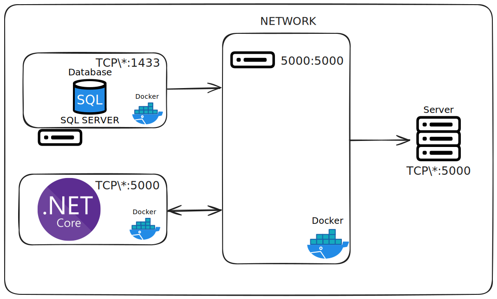

1. Requisitos de Sistema:

- Servidor com Docker instalado.
- Servidor com Docker Compose instalado.

2. Manual Starting Release:

- Passo 1: Clone o repositório do projeto MyFinance.
- Passo 2: Acesse a pasta "src" do projeto no servidor.
- Passo 3: Execute o comando:

```bash
 docker compose -p myfinance up -d --build --force-recreate
```

- Passo 4: Acesse a aplicação no navegador através do endereço fornecido pelo Docker Compose.
- Acesso Padrão: http://localhost:5000.

## Modo de Desenvolvimento

Antes de iniciar o desenvolvimento das novas features, é necessário configurar o ambiente de desenvolvimento.

Para iniciar o projeto em modo de desenvolvimento, siga os passos abaixo:

- Acesse a pasta src no terminal.
- Execute o seguinte comando:

```bash
dotnet watch run --project ./MyFinanceWeb.Web/ --environment Development
```

Certifique-se de que a connection string esteja apontando para a instância local de desenvolvimento do banco de dados MyFinance. Verifique também se todas as dependências do projeto estão instaladas corretamente.

- O projeto será iniciado e estará disponível em http://localhost:5000.

## Arquitetura Modular

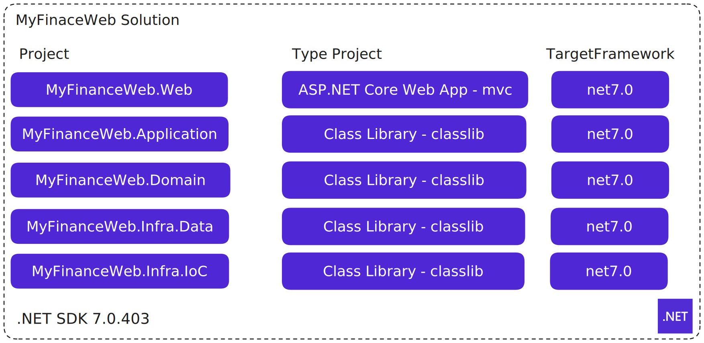

<p>
A arquitetura do projeto MyFinanceWeb foi dividida em cinco projetos individuais, cada um responsável por uma camada específica da aplicação.</p>

<p>
Essa abordagem modular permite uma melhor organização e separação de responsabilidades, facilitando a manutenção, testabilidade e escalabilidade da solução.</p>

<p>
O projeto MyFinanceWeb utiliza o .NET SDK 7.0.403 como plataforma de desenvolvimento. 
Esse SDK permite a criação e execução de projetos .NET Core 7.0, que oferecem maior desempenho, facilidade de uso e suporte aprimorado para a criação de aplicações modernas.
</p>

## Modelagem DDD (Domain Driven Design)

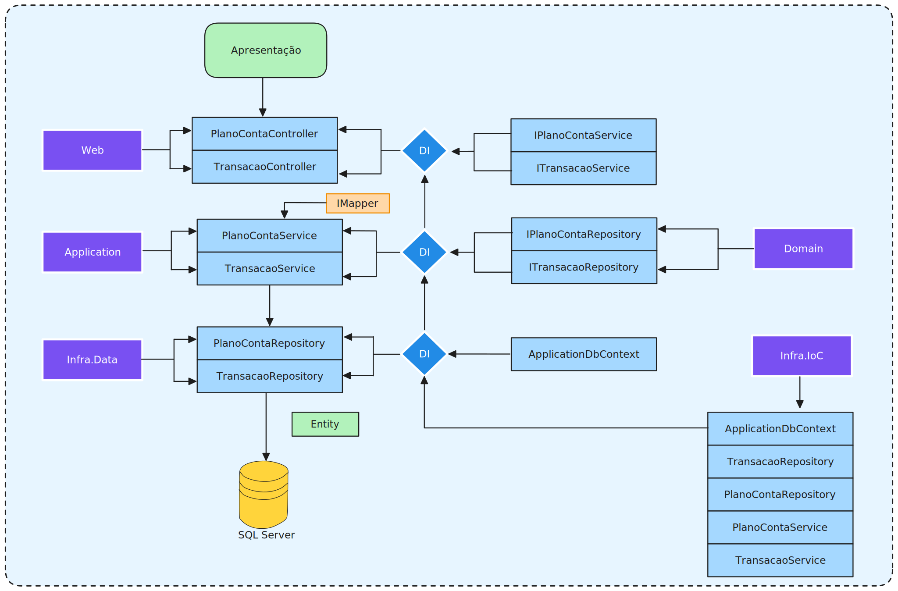

### 1. MyFinanceWeb.Web

<p>
O projeto MyFinanceWeb.Web é a camada de User Interface da aplicação. Ele foi criado como um projeto ASP.NET Core Web App utilizando o padrão MVC (Model-View-Controller).
Nessa camada, são definidas as rotas, modelos de view e controladores responsáveis por receber as requisições HTTP dos usuários e retornar as respostas adequadas.
</p>

### 2. MyFinanceWeb.Application

<p>
O projeto MyFinanceWeb.Application é a camada de Aplicação da solução. Ele contém todos os serviços e regras de negócio que a aplicação web irá consumir. 
Essa camada é responsável por orquestrar as chamadas entre a camada de User Interface (Web) e a camada de Domínio, aplicando as regras de negócio e realizando as operações necessárias.
</p>

### 3. MyFinanceWeb.Domain

<p>
O projeto MyFinanceWeb.Domain é a camada de Domínio da aplicação. Aqui são definidas as entidades de domínio, que representam os conceitos centrais e as regras de negócio da aplicação. 
Além disso, essa camada também define as interfaces de repositório, que serão implementadas na camada de Infraestrutura (Dados).
</p>

### 4. MyFinanceWeb.Infra.Data

<p>
O projeto MyFinanceWeb.Infra.Data é a camada de Dados da aplicação. Nessa camada, é estabelecida a conexão com o banco de dados e são implementados os repositórios, que são responsáveis pela manipulação e persistência dos dados. 
Essa camada utiliza as interfaces definidas na camada de Domínio para garantir a separação de responsabilidades e a aplicação do princípio de inversão de dependência.
</p>

### 5. MyFinanceWeb.Infra.IoC

<p>
O projeto MyFinanceWeb.Infra.IoC é a camada responsável por resolver as injeções de dependência entre as camadas da aplicação. 
Ele utiliza o padrão de inversão de controle (IoC) para centralizar a configuração das dependências e facilitar o gerenciamento das diferentes instâncias de objetos necessárias para o funcionamento da solução.
</p>

### Camada de Serviços

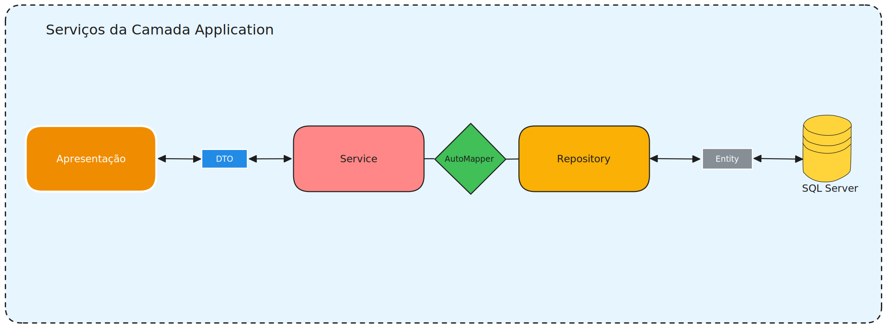

- O Serviço da **Camada de Aplicação** recebe as solicitações da camada de **Apresentação** e executa as operações necessárias.
- A comunicação entre o Serviço da Camada de Aplicação e a camada de **Apresentação** é feita através de **DTOs**.
- Os DTOs são objetos simples que transportam os dados entre as camadas.
- O Serviço da Camada de Aplicação utiliza um **repositório** de dados para acessar e manipular os dados no banco de dados.
- O **AutoMapper** é uma ferramenta comumente utilizada para converter os DTOs em entidades do banco de dados.
- O Serviço da Camada de Aplicação realiza validações e verificações necessárias antes de executar as operações no banco de dados.


### Teste das Funcionalidades

#### Dashboard

#### Plano de Contas
##### Plano de Contas - List
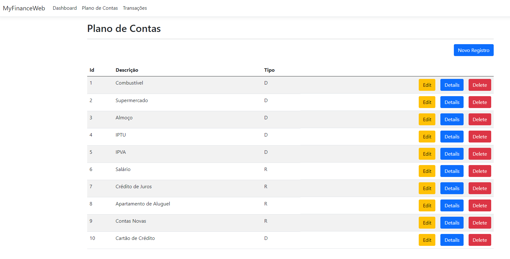
##### Plano de Contas - Create
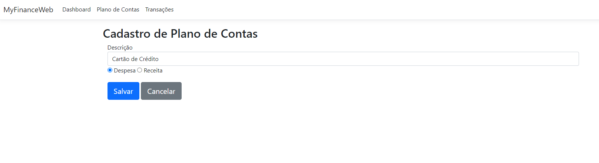
##### Plano de Contas - Details
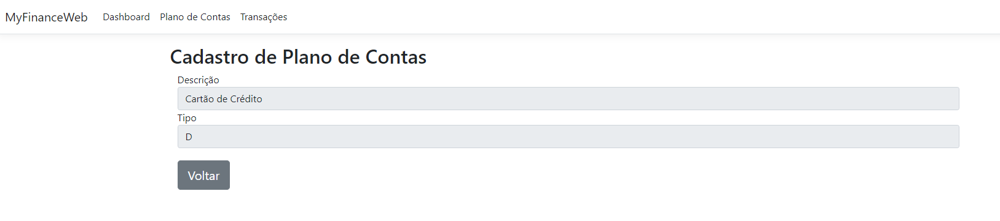
##### Plano de Contas - Edit
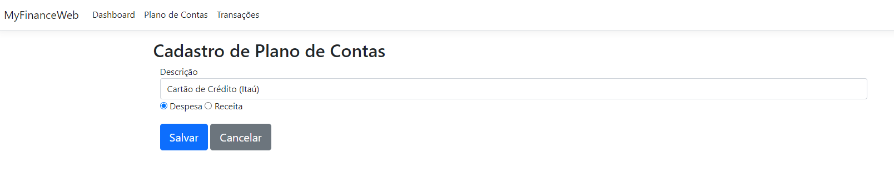
##### Plano de Contas - Delete
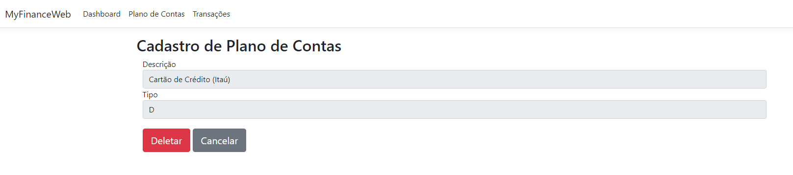
#### Transações
##### Transações - List

##### Transações - Create
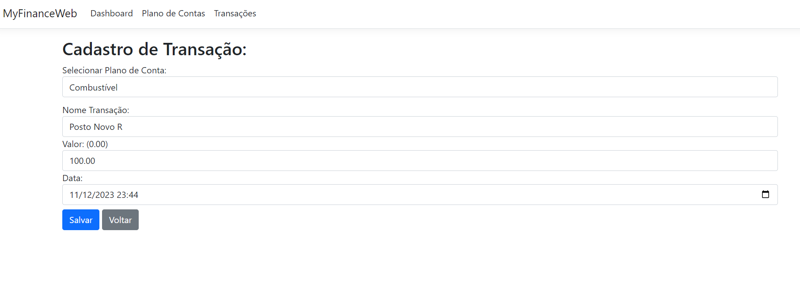
##### Transações - Details
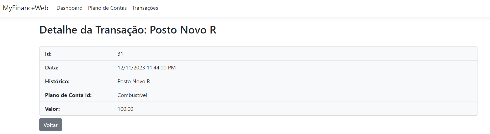
##### Transações - Edit
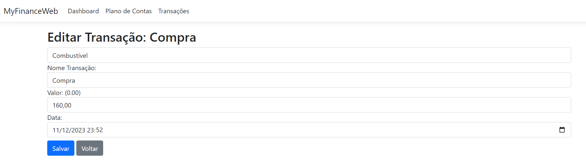
##### Transações - Delete
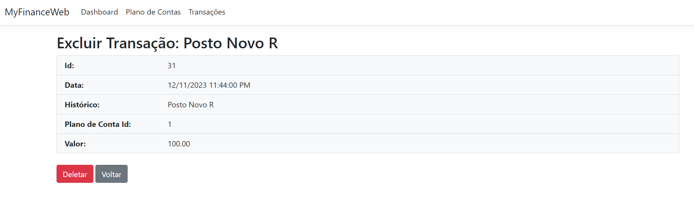

