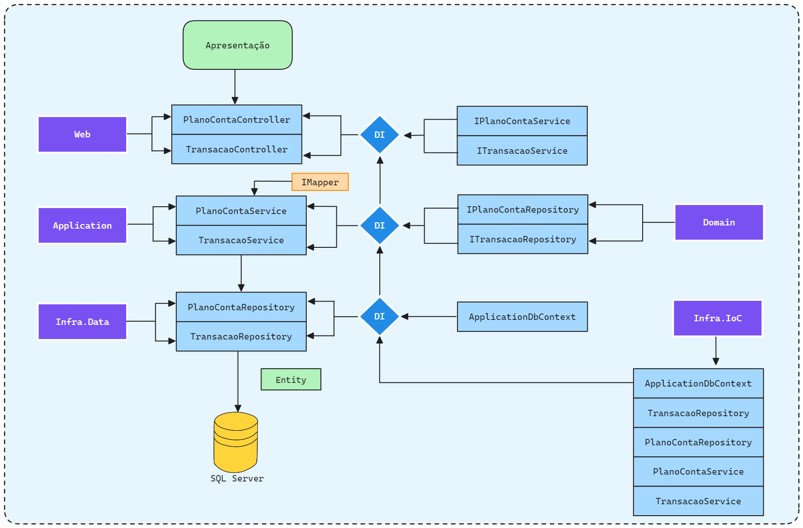

# MyFinance Web
Esta aplicação deve permitir que o usuário monte uma espécie de Plano de Contas para categorizar
todas as Transações realizadas.


### Start Project
Starting Application in mode Development
```powershell
dotnet watch run --project .\MyFinanceWeb.Web\ --environment Development
```

### Arquitetura em Camadas


### Camada de Serviços 


